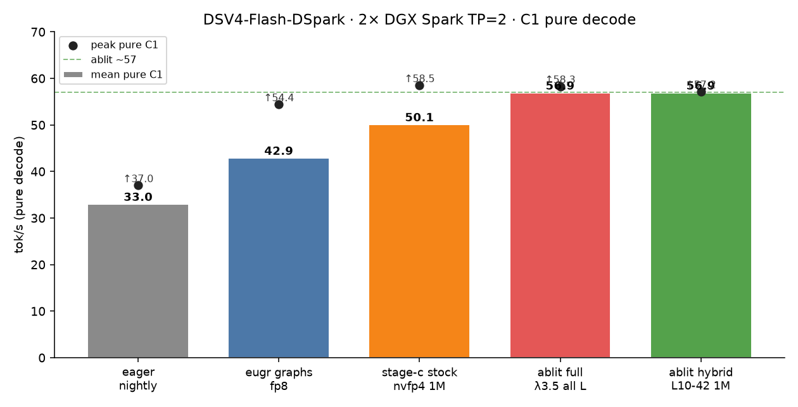
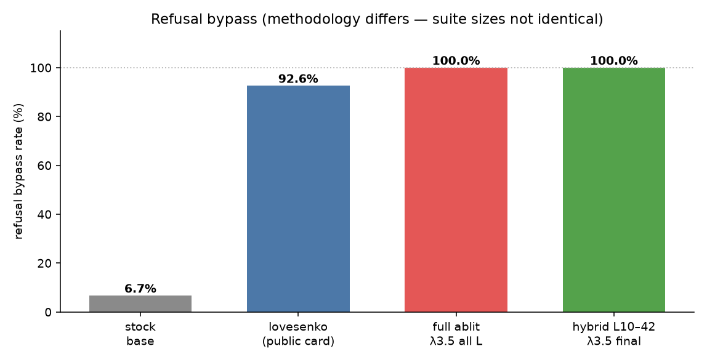
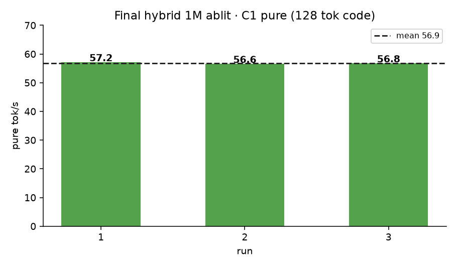

# DeepSeek-V4-Flash-DSpark — Abliterated (Uncensored) · 1M · ~57 tok/s



**Weights (Hugging Face):**  
https://huggingface.co/drowzeys/DeepSeek-V4-Flash-DSpark-Abliterated-Uncensored

**Full numbers + raw JSON:** [RESULTS.md](RESULTS.md) · [results/](results/)

Local abliterated build of **DeepSeek-V4-Flash-DSpark** for **2× NVIDIA DGX Spark (GB10)** with:

| | |
|---|---|
| Context | **1,048,576** (`nvfp4_ds_mla` KV · ~2.39M pool) |
| C1 pure | **~57 tok/s** (code decode, TP=2 stage-c, DSpark k=5) |
| Refusal bypass | **~100%** on 32-prompt battery + hard probe |
| Hermes | works with **on-demand** skills prompt (not “mandatory MUST load”) |




> Research / local use only. Removes most stock safety refusals.


## Responsible Use (required)

> **WARNING:** This model has had **safety refusals removed**. That makes it useful for red-teaming, security research, evaluation, and unfiltered assistant tasks — and also removes guardrails **you** must supply yourself.

**Full agreement:** → **[RESPONSIBLE_USE.md](RESPONSIBLE_USE.md)**

### Prohibited uses (you must agree)

- Anything involving the **sexual exploitation or endangerment of minors**
- You must be **18 years of age or older** to use and download this model
- Any information generated that can cause harm (e.g. recipes / knowledge to make materials or substances) is **your own input and responsibility**; you are **accountable for any harm/damage** from your action/input
- Content promoting **self-harm or suicide**
- Material that is **illegal in your jurisdiction**, or that targets real individuals for **harassment, doxxing, or fraud**
- Any use prohibited by the **upstream DeepSeek license**

### Your responsibility

You must add appropriate **safety filtering**, **human review**, and **access controls**. Weights are **as-is, no warranty**. Review and comply with the upstream DeepSeek license before use or redistribution.

### Hugging Face access fields (gated)

Request access at: https://huggingface.co/drowzeys/DeepSeek-V4-Flash-DSpark-Abliterated-Uncensored  

| Field | Notes |
|---|---|
| **Username** | May default to your HF username |
| **Email** | May default to your HF account email |
| **Reason for intended use** | e.g. red-teaming, evaluation, research, local assistant |

Plus the agreement checkboxes on the HF form.


## What’s in the weights

Hybrid **layer-range** abliteration (mHC-resistant; LoRA does not work on this family):

- **Stock** `attn.wo_b` · layers **0–9** (chat / tools / protocol)
- **Abliterated** `attn.wo_b` · layers **10–42** + **MTP** draft heads
- SRA-cleaned **rank-1** refusal direction · **λ = 3.5**
- FP8 dequant → project → requant (same DSpark shard layout)

Base: [deepseek-ai/DeepSeek-V4-Flash-DSpark](https://huggingface.co/deepseek-ai/DeepSeek-V4-Flash-DSpark)

## Quick start (2× DGX Spark)

```bash
# 0. Image (GB10 stage-c / B12X / graphs)
docker pull ghcr.io/drowzeys/vllm-dspark-nvfp4-stage-c:gb10
docker tag  ghcr.io/drowzeys/vllm-dspark-nvfp4-stage-c:gb10 \
  vllm-dspark-runtime:dspark-nvfp4-stage-c

# 1. Weights on BOTH nodes (~157 GB)
hf download drowzeys/DeepSeek-V4-Flash-DSpark-Abliterated-Uncensored \
  --local-dir ~/models/dsv4-flash-dspark-abliterated

# 2. Edit MASTER/IF/HCA in scripts/dsv4-nvfp4-1m-serve.sh
# 3. Rank1 first, then rank0 (API :8000)
MODELDIR=~/models/dsv4-flash-dspark-abliterated \
  bash scripts/dsv4-nvfp4-1m-serve.sh 1
MODELDIR=~/models/dsv4-flash-dspark-abliterated \
  bash scripts/dsv4-nvfp4-1m-serve.sh 0
```

## Rebuild abliteration (optional)

```bash
# After capturing refusal directions (see scripts/prompts.py + compute_direction.py)
python3 scripts/project_wob.py \
  --src ~/models/dsv4-flash-dspark \
  --dst ~/models/dsv4-flash-dspark-abliterated \
  --direction work/refusal_direction_r1.pt \
  --lambda-attn 3.5 --min-layer 10 --max-layer 42 --n-directions 1
```

## Hermes agent

Abliterated models will **echo the skills catalog** if Hermes still uses:

> “Skills (mandatory) … MUST load with skill_view … Err on the side of loading”

Use the **on-demand** skills rules (patch or equivalent):

- Greetings / simple Q → plain short text, **no** `skill_view`
- Never paste the skills index into the reply
- Load skills only for concrete multi-step tasks

Also recommended: `model.max_tokens: 8192`, `temperature: 0`, `tool_use_enforcement: false`.

See [docs/HERMES_SPILL_FIX.md](docs/HERMES_SPILL_FIX.md) and [docs/STATUS_FINETUNE.md](docs/STATUS_FINETUNE.md).

## Repo layout

```
charts/          # C1, refusal, KV, recipe-evolution PNGs
results/         # raw JSON evals, refusal suites, direction vector, ABLIT_META
docs/            # STATUS, Hermes spill notes
scripts/         # serve + abliteration tooling
RESULTS.md       # full performance + refusal write-up
```

| path | contents |
|---|---|
| [RESULTS.md](RESULTS.md) | performance + refusal methodology |
| [results/eval_tune_final.json](results/eval_tune_final.json) | final dual-goal pass |
| [results/refusal_suite_1m_ablit.json](results/refusal_suite_1m_ablit.json) | 32-prompt suite + labels |
| [results/ABLIT_META.json](results/ABLIT_META.json) | λ / layer range / edit stats |
| [charts/](charts/) | figures used in RESULTS |

## Measured (publish cluster)

- Topology: TP=2 · nodes `10.100.10.3` + `.4` · 200G RoCE  
- Image: `vllm-dspark-runtime:dspark-nvfp4-stage-c`  
- KV pool @ 1M: ~2.39M tokens  
- C1 pure: ~57 tok/s mean class on code prompts  

## Disclaimer

Research release. Outputs may include content stock models refuse. Do not deploy without your own safety layer. No liability for misuse.

## Links

- Weights: https://huggingface.co/drowzeys/DeepSeek-V4-Flash-DSpark-Abliterated-Uncensored  
- Stage-c image (optional): `ghcr.io/drowzeys/vllm-dspark-nvfp4-stage-c:gb10`  
- Base model: https://huggingface.co/deepseek-ai/DeepSeek-V4-Flash-DSpark  
