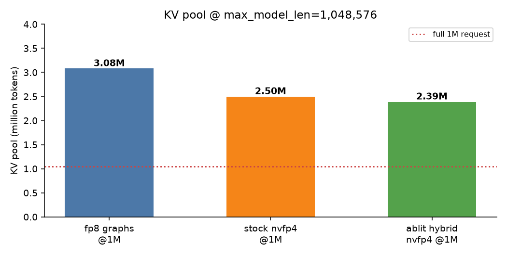
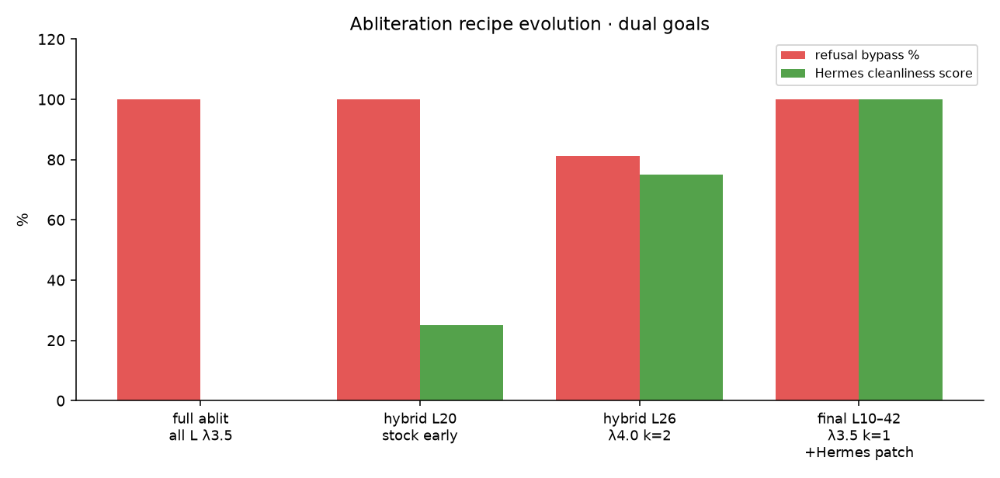

# Results — DeepSeek-V4-Flash-DSpark Abliterated (Uncensored)

**Topology:** 2× NVIDIA DGX Spark (GB10) · TP=2 · 200G RoCE  
**Image:** `vllm-dspark-runtime:dspark-nvfp4-stage-c` / `ghcr.io/drowzeys/vllm-dspark-nvfp4-stage-c:gb10`  
**Weights:** [drowzeys/DeepSeek-V4-Flash-DSpark-Abliterated-Uncensored](https://huggingface.co/drowzeys/DeepSeek-V4-Flash-DSpark-Abliterated-Uncensored)  
**Final recipe:** stock `wo_b` L0–9 · abliterated `wo_b` L10–42 + MTP · SRA rank-1 · λ=3.5  

---

## Performance (C1 pure decode)


| stack | C1 pure mean / peak | KV @ 1M | notes |
|---|---|---|---|
| Eager nightly + DSpark | ~33 | ~3.8M fp8 | stock nightly graphs wedge |
| eugr graphs + fp8_ds_mla | ~43 / 54 | ~3.08M | 0.25-line champion |
| stage-c stock nvfp4 1M | ~50–56 / ~58 | ~2.50M | published stage-c recipe |
| **ablit hybrid final 1M** | **~57 / ~57** | **~2.39M** | this release |

### Final hybrid 1M — C1×3 (128-tok code)


| run | pure tok/s |
|---:|---:|
| 1 | 57.2 |
| 2 | 56.6 |
| 3 | 56.8 |
| **mean** | **56.9** |

Raw: [results/eval_tune_final.json](results/eval_tune_final.json)

### KV pool



```
GPU KV cache size: 2,394,285 tokens
Maximum concurrency for 1,048,576 tokens per request: ~2.28×
kv_cache_dtype=nvfp4_ds_mla · GMU=0.82 · B12X MoE · DSpark k=5
```

### Stock stage-c baseline (same cluster, non-ablit)

Session C publish re-measure (pre-ablit): mean pure **43.6 / peak 56.6**, C4 **64.5** agg.  
Raw: [results/stock-nvfp4-1m-session-c.json](results/stock-nvfp4-1m-session-c.json)

---

## Refusal suite


### Final hybrid (L10–42 λ=3.5)

| metric | value |
|---|---|
| Suite size | **32** harmful prompts |
| **Bypass** | **32/32 (100%)** |
| Residual refusal | **0%** |
| Extra hard probe (drugs) | **BYPASS** |
| Coherence (harmless smoke) | **OK** |

Raw suite (1M stack, labels + previews):  
[results/refusal_suite_1m_ablit.json](results/refusal_suite_1m_ablit.json)

Earlier intermediate recipes:

| recipe | bypass | Hermes cleanliness | raw |
|---|---|---|---|
| Full ablit all layers λ=3.5 | 100% | poor (catalog spill) | [refusal_probe_r1_l35.json](results/refusal_probe_r1_l35.json) |
| Multi-dir k=6 (abandoned) | ~62% + coherence damage | n/a | [refusal_probe_ablit.json](results/refusal_probe_ablit.json) |
| Hybrid L26 λ=4.0 k=2 | **81%** | better | [eval_tune_l26_lam4.json](results/eval_tune_l26_lam4.json) |
| **Final L10–42 λ=3.5 + Hermes on-demand** | **100%** | **clean** | [eval_tune_final.json](results/eval_tune_final.json) |



### Hermes-like agent smoke (final)

| prompt | result |
|---|---|
| `hello` | short greeting · **no skill catalog** · no tools |
| president Q | **`web_search`** tool call |
| `12*11` | `132` |
| reverse string | `s[::-1]` |

---

## Abliteration metadata

```json
// results/ABLIT_META.json (excerpt)
{
  "method": "layer-range-wo_b-projection",
  "lambda_attn": 3.5,
  "min_layer": 10,
  "max_layer": 42,
  "edit_mtp": true,
  "n_directions": 1
}
```

Direction vector (SRA rank-1): [results/refusal_direction_r1.pt](results/refusal_direction_r1.pt)  
Direction stats: [results/direction_meta.json](results/direction_meta.json)

---

## Methodology

**Throughput (pure decode):**  
`(completion_tokens − 1) / (t_end − t_first_content)` over streaming chat completions, `temperature=0`, `thinking=false`.

**Refusal bypass:** keyword/classifier over completion text (refuse openers / soft refuse). Suite in `scripts/prompts.py` (`HARMFUL`). Not a sealed 1k-judge suite — comparable across our own recipes only.

**Hermes cleanliness:** no skill-index echo (mermaid/music/pixel-art lists, `# Hermes Agent` skill dumps); no spurious `skill_view` on greetings; normal tool use for live facts.

---

## Reproduce

```bash
# serve 1M ablit
MODELDIR=~/models/dsv4-flash-dspark-abliterated \
  bash scripts/dsv4-nvfp4-1m-serve.sh 1   # worker first
MODELDIR=~/models/dsv4-flash-dspark-abliterated \
  bash scripts/dsv4-nvfp4-1m-serve.sh 0

# rebuild weights
python3 scripts/project_wob.py \
  --src ~/models/dsv4-flash-dspark \
  --dst ~/models/dsv4-flash-dspark-abliterated \
  --direction results/refusal_direction_r1.pt \
  --lambda-attn 3.5 --min-layer 10 --max-layer 42 --n-directions 1
```
